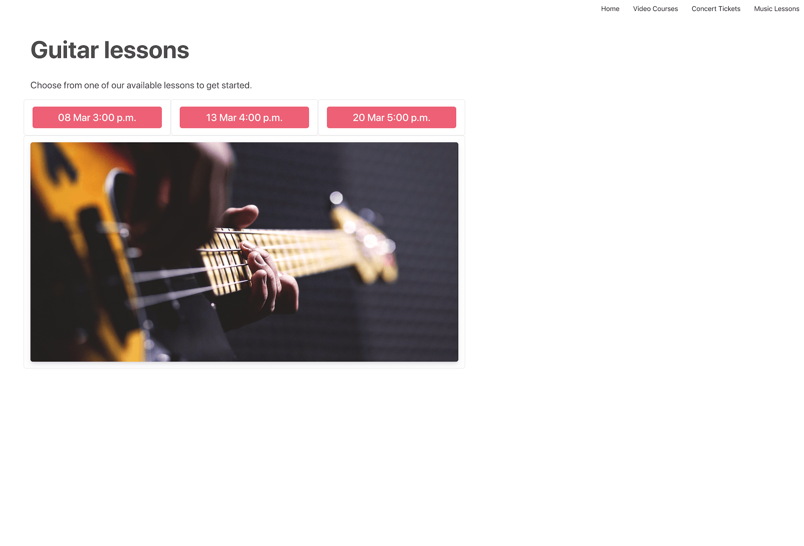

# Card Payments Certification Challenge Section 3: Online Lessons

### Sections
[Challenge Overview](/README.md)

[Section 1: Sell concert tickets](/README-pt1-concerttickets.md)

[Section 2: Sell video courses](README-pt2-videopurchase.md)

[Section 3: Lesson signups and payments](README-pt3-lessonsignup.md)

# Getting started
To goal of this section of the challenge is to add functionality to the app that allows customers to sign up for online lessons, and for the music store to manage payments for those lessons. 

# Section Overview
The store has gotten a lot of nice feedback from their instructional videos and recitals and has decided to start offering online guitar lessons.  While music lessons are typically sold as month to month commitments, the store wants to appeal to busy adults, not require them to commit to weekly lessons and instead let students book lessons individually.   The flow they want to support looks like this: 

- Students will sign up for lessons by selecting a time for their first lesson and providing their credit card
- Prior to the lesson the store will authorize the students card for the lesson.  This has to happen separate from the sign up because the lesson might be several weeks out. 
- After the lesson the instructor will capture the payment amount.  It’s up to the instructor to decide the total amount of the lesson as long as it’s less than the authorization amount.  For example, if they only met for 45 min but had purchased an hour, the instructor might not charge the student the full amount. 
- Future lessons will be coordinated by teacher and student and authorized and then captured like the first lesson. 

# Requirements
There are three parts to this section of the exam that you need to complete: 

- **Part 1: Lesson signup, account update and delete:** You’ll complete the app to create customers, add or update a stored payment method, and delete the customer when requested. 
- **Part 2: Create and refund payments:** You’ll add functionality so that the store can create and refund payments. This section has no UI, you will only need to  complete the server routes for each section. 
- **Part 3: Gather information about the store's lesson business:**  In this section you’ll calculate the total amount that the school has earned on guitar lessons so they can pay the teacher. You'll also determine what student need to update their payment methods. This section has no UI, you will only need to  complete the server routes for each section.  

Note: in a real application, you’d likely have a database to manage customer details, historical payment information and your app would require authentication for a lot of this functionality.  For the purposes of this exam we have none of this, and we ask to you to engage in a little suspension of disbelief. You can imagine what you are building sitting inside a more robust application, or that for functionality that requires you to pull information from the API will eventually migrate to a local database. 

## Part 1: 
### Lesson signup and card collection
To sign up for lessons the student needs to select an initial lesson time and provide their payment information. 

- Complete `lessons.html` or `src/pages/Lessons.js` (react client), and the `/lessons` route to allow the student to pick a time for their first lesson and provide their credit card to sign up for lessons. This page should use Elements and Setup Intents, since the available lesson times are always more than 1 week out. 
- The app should ensure there is only 1 Customer object per email address. If a customer tries to sign up again with the same email address, the app should show them the provided error and a link to the account-update.html where they can update their payment information.  
- The app should ensure a customer only ever has 1 payment method stored. 
- Set both the Customer and the payment's methods billing details to the name and email address they supply. 
- Set a metadata field `first_lesson` to the lesson date and time they select.  The store will use this later to determine when to make the first payment. 
- After the student has successfully signed up for a lesson, complete message displayed in the `id="signup-status"` div to show the new customer id and the last 4 of their card. 

### Account update
Students can update their payment information on the account update page. 

- Complete `account-update.html` or `src/pages/AccountUpdate.js` (react client), and `/account-update/:customer_id` so that a customer can update the payment method they have on file. This page should also use Setup Intents and Elements.  
- Complete the `account-update.html` page so that the details of the students card are displayed when the page is loaded and after the payment method is updated.   See the div `id="account-information"` in the HTML for the specific fields. 
- Update the customer object using the payment method generated by the Setup Intent.  This update should replace the payment method currently associated with the customer. 
- Update the name or email address for the customer object if the customer updates it. Display an error if the a new email address supplied is already associated with another customer. 

### Account delete
Students may decide they want to cancel their account and no longer have their payment method on file. However the music store doesn’t want to automatically close any accounts that have payments authorized but not yet captured. Complete the `/delete-account/:customer_id` route to do the following: 

- Given a customer id as a parameter, delete the Customer object in Stripe if there aren’t any uncaptured payments associated with the customer.  Return any errors that occur if the delete call fails.
- If the customer does have uncaptured payments return information about those uncaptured payments in the response so the music store administrator can see them.
- Note there is no UI for this functionality, you only need to complete the server route. 

## Part 2
### Schedule a lesson and authorize a payment
Complete the `/schedule-lesson` route to authorize a payment for an upcoming lesson. 

- This route takes the following parameters: 
    - `customer id`
    - `amount` the price of the lesson in cents
    - `description` of the lesson
- You can assume the currency of the charge is `usd`
- Returns either information about the payment intent created or an error.

### Complete a lesson payment
Complete the `/complete-lesson-payment` route to capture an authorized charge for a lesson. 
- This route take the following parameters: 
    - `payment_intent_id`: the id of the payment intent to capture
    - `amount`: (optional) an optional amount to capture.  This parameter would be supplied if the teacher decided to give a discount on the lesson for some reason. 
- Returns information about the payment intent or an error. 

### Refund a lesson
Complete the  `/refund-lesson` route so that the music store can refund the student. The store will use this route to refund payments lessons that have already happened and also to cancel an auth if an upcoming lesson is canceled. 
- This route take the following parameters: 
    - `payment_intent_id`: the id of the payment intent to refund
    - `amount`: (optional) an optional amount to refund.  This parameter would be supplied if the store decided to give a refund only part of a lesson payment. 
- Returns the refund id if successful, or an error. 

## Part 3: 
Gather information about the store's lesson business.  In this section you’ll calculate the total amount that the school has earned on guitar lessons so they can pay the teacher. You'll also determine what student need to update their payment methods.

### Total earned from lessons
The music store need to calculate how much they have earned on lessons so that they can pay their teacher . Complete the `/calculate-lesson-total` route to return the total amount of money the store has netted from lessons, minus any Stripe fees or refunds (including refunds due to disputes). 

- For now this route doesn’t take any parameters. 
- Returns information about the total and net amounts earned, plus total amount paid in fees. 

### Find customers with bad payment methods
Every week the music store would like to send out an email asking customers to update their payment information if necessary.  Complete the `/find-customers-with-failed-payments` route to return a list of customers who meet the following two requirements: 

- The last payment associated with them did not succeed
- The payment method on file for them matches the payment method used for the failed payment attempt.  In other words, the customer has not yet updated their payment method and the store can except future payments to also fail. 

- For now this route doesn’t take any parameters
- For each customer identified returns information about the customer, their stored payment method and the failed payment. 

# Using the provided starter code
For this section of the exam there is a UI component only for the lesson sign and account update. For the rest of the requirements you only need to complete the specified route within the server.  See the server file for more information on parameters each route should accept and the format of the JSON response they should return. 

**client**

`/lessons.html` -> the lesson sign up page shown in the screen shots above. If you would like to replace this with a template from your preferred framework you may do so, but please preserve existing DOM element ids in the page. 

`/assets/js/lesson-signup.js` -> This file contains various functions you should utilize on the page, feel free to modify any of these functions as you integrate Elements. 

`/account-update.html`  -> the account sign up page shown in the screen shots above. If you would like to replace this with a template from your preferred framework you may do so, but please preserve existing DOM element ids in the page. 

`/assets/js/account-update.js` -> This file contains various functions you should utilize on the page, feel free to modify any of these functions as you integrate Elements. 

React Client:
* `src/pages/Lessons.js` → Equivalent to /lessons.html.
* `src/pages/AccountUpdate.js` → Equivalent to /account-update.html.
* `src/components` → Contain building blocks for each of the components mentioned above. 
* `src/Services/account.js` → API petitions for backend (AccountUpdate endpoints).

The client directory contains additional CSS, JavaScript and image files in the `assets` directory, we don't expect you to need to modify any of the files in these. 

**server** 

On the server side we've defined defined all the routes above.  Please use those to complete the functionality.  See the server file for more information on parameters each route should accept and the format of the JSON response they should return. 

## Running locally

As a first step in completing the challenge we recommend you get your local server up and running.  

See the main README info on getting up and running with our server implementations. 

With your server running the page for this section should look like this: 

## Submitting your challenge

When you are done with this section and checked that your code works locally, push your changes to the branch you are working on. You can open a PR per section completed or a single PR to merge the solution for the 3 sections.
