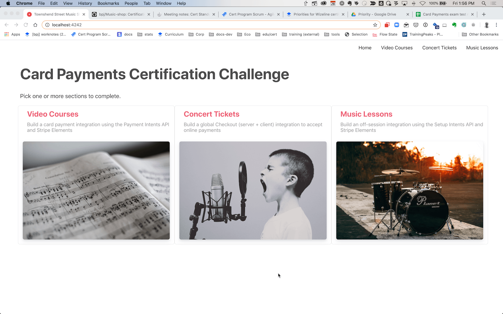

# Card Payments Certification

### Sections
[Challenge Overview](/README.md)

[Section 1: Sell concert tickets](/README-pt1-concerttickets.md)

[Section 2: Sell video courses](README-pt2-videopurchase.md)

[Section 3: Lesson signups and payments](README-pt3-lessonsignup.md)

# Getting started
To goal of this coding challenge is to complete the app started in this repo, a website for a music store.  To get started: 

* Read this doc to get an overview of how the challenge is set up. 
* When you're ready to begin, select your server language and make sure you can pull and run the repo locally. 
* Complete one or more sections of the challenge. When you've finished, deploy your solution and push it back to this repo.


**Getting Help**

If you need any help please reach out to @dawn or @fluitt in the #certification channel. 

<!---
**Submitting Feedback**

As you are working on the exam, please provide your feedback using [this template](https://paper.dropbox.com/doc/Feedback-template--AvEpcSZ~0bfVsDMLDvoYP~SaAg-x5DuZoa4calakIToTlAhf)
-->
# Challenge Overview

Looking to grow their business a US-based music school wants to expand their online presence to include selling instructional videos, concert tickets and by offering online lessons. The challenge is broken up into 3 sections, please pick one or more to complete: 

# Using the provided starter code

Within the code directory you'll fine the [starter code](code/) for client and server, you selected to complete the exam.

The README for each section of the challenge provides more information about the starter code specific for that section. 

We hope the starter code is helpful to you, but feel free to use a different framework if that's easier for you.  Please let us know in the feedback doc why you decided to not use the starter code and how we could make it better.

## Running locally

As a first step in completing the challenge we recommend you get your local server up and running:

**1. First checkout the repo and configure the environment variables:**

Copy the .env.example file into a file named .env in the folder of the server you want to use. For example:

```
cp .env.example code/server/.env
```

Replace the placehold variables in the .env file wtih your keys: 

```
STRIPE_PUBLISHABLE_KEY=<replace-with-your-publishable-key>
STRIPE_SECRET_KEY=<replace-with-your-secret-key>
STRIPE_WEBHOOK_SECRET=<replace-with-your-webhook-secret>
```

`STATIC_DIR` tells the server where to the client files are located and does not need to be modified unless you restructure the directories.

We've also provided a config file, `config.json` which contains some constants used by the video and concert tickets sections of the app.  See the server file for examples of how to load these values. 

**2. Follow the server instructions on how to run:**

Please follow the instructions in the README you'll find in the code/server folder on how to run your server.

With your server running the page should look like this:





**3. [Optional] Run a webhook locally:**

We recommend using the Stripe CLI to easily spin up a local webhook.

First [install the CLI](https://stripe.com/docs/stripe-cli) and [link your Stripe account](https://stripe.com/docs/stripe-cli#link-account).

```
stripe listen --forward-to localhost:4242/webhook
```

The CLI will print a webhook secret key to the console. Set `STRIPE_WEBHOOK_SECRET` to this value in your .env file.

You should see events logged in the console where the CLI is running.


## Your Stripe Account

We'll run test mode transaction on your Stripe account to test your solution. If this activity might disrupt your other work you may want to spin up a separate Stripe account just for your certification challenges.  We recommend you keep the account you use for certification challenges up to date with the latest API version. 


## Submitting your challenge

When you are done there are 3 steps to submitting your solution:

* Open a pr with the changes you want to merge into master
* let us know you’ve completed the exam by filling in the template provided. You can either do one push or one per challenge completed. We advise you to create a separate branch in which you can work your solution before merging it into master.
* Merge your changes to master.

**Note**: Please make sure all your features run in the lastest version of google chrome.

**Navigation**
[Continue to Section 1: Sell Concert Tickets](/README-pt1-concerttickets.md)

